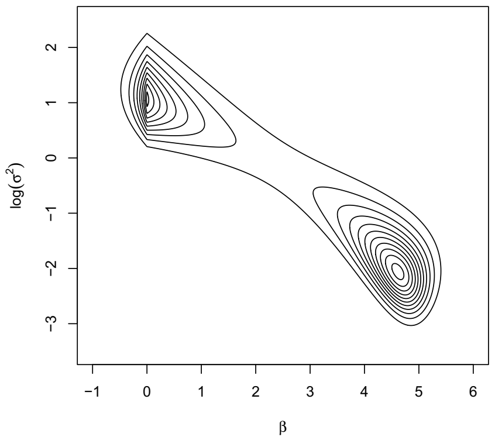
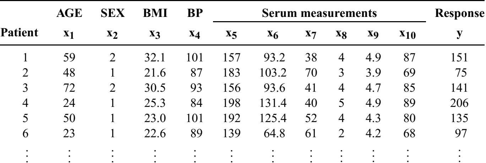

```{r setup, include=FALSE}
knitr::opts_chunk$set(echo = FALSE, warning = FALSE, message = FALSE)
```

## Bayesian Lasso (Park and Casella, 2008)

Park, Trevor, and George Casella. "The Bayesian lasso." Journal of the American Statistical Association 103.482 (2008): 681-686.

**Outline**

\begin{enumerate}
\item Survey wide data and frequentist Lasso
\item  Toy example 
\item  Bayesian duality 
\item  Bayesian Lasso : 
\begin{enumerate}
   \item Implementation 
   \item Example 
\end{enumerate}
\item Conclusion 
\end{enumerate}

## Introduction
### Wide Data

- Modern data sets are wide: $p \gg n$, more features than the sample size.
- Biological data: Microarrays, often tens of thousands of genes
(features); while only tens of hundreds of samples.
- Many applications in computer vision deal with high-dimensional data.
- Different types of linear models are popular tools for such
examples: e.g. linear regression, logistic regression. However, for these datasets, we cannot fit these models using standard approaches.

## Approaches

Three Main Approaches for Improving Linear Model:

- Subset Selection: Identifying a subset of the $p$ predictors that
we believe to be related to the response, then fit a model on
the reduced set of variables. (e.g. Best subset selection)

- Shrinkage: fitting a model involving all $p$ predictors. However,
the estimated coefficients are shrunken towards zero. Shrinkage has the effect of reducing variance. (e.g. Lasso and Ridge)

- Dimension Reduction: Projecting the $p$ predictors into a
$M$-dimensional subspace, where $M < p$. Then these $M$
projections are used as predictors to fit a linear regression
model by least squares. (e.g. PCA)

## Issues

- Best subset selection: entails fitting $2^p$ models - infeasible beyond moderate values of $p$. 
- Dimension reduction: Linear combination of covariates are harder to interpret, if not impossible.

## Lasso

- The name is actually an acronym for Least Absolute Selection and Shrinkage Operator.

- The lasso is a method for simultaneous shrinkage and model selection in regression problems.

- It is most commonly applied to the linear regression model:
$$
y = \mu 1_{n} + X \beta + \epsilon
$$

## Lasso(cont.)

- Lasso regression solves the following optimization problem:
$$
\min_{\beta} \  (\tilde{y} - X \beta)^{T}(\tilde{y} - X \beta) + \lambda \sum^{p}_{j = 1}| \beta_{j} |
$$
Where $\tilde{y} = y - \bar{y} 1_{n}$ is the mean-centered response vector. The left term is RSS of the model; while the right term is shrinkage penalty $\ell_1$. 

## A Toy Example of Lasso
- Generate $X, y$ with $n=30, p=60$ with a sparse $\beta$ vector with 5 non-zero elements.
- Our goal is to see if Lasso can recover the 5 non-zero $\beta$'s correctly.

\scriptsize
```{r eval=FALSE, message=FALSE, warning=FALSE}
library(Matrix)
library(glmnet)
set.seed(12345)
n=30;p=60
p1 = 5
beta <- c(rep(3,p1),rep(0,p-p1))
para=scale(matrix(rnorm(n*p),n,p))
eps=rnorm(n,mean=0,sd=0.1)
fx = para %*% beta
result=drop(fx+eps)
cv.out =cv.glmnet(para,result,alpha =1)
bestlam =cv.out$lambda.min
grid=10^seq(10,-2,length=100)
lasso.mod =glmnet(para,result,alpha =1,lambda =grid)
lasso.coef=predict(lasso.mod,type="coefficients",s=bestlam)
col.index = c(rep(2,p1),rep(3,p-p1))
plot(lasso.coef[-1], col = col.index, pch = 15)
```

## A Toy Example of Lasso
### Variable Selection
```{r echo=FALSE, message=FALSE, warning=FALSE}
library(Matrix)
library(glmnet)
set.seed(12345)
n=30;p=60
p1 = 5
beta <- c(rep(3,p1),rep(0,p-p1))
para=scale(matrix(rnorm(n*p),n,p))
eps=rnorm(n,mean=0,sd=0.1)
fx = para %*% beta
result=drop(fx+eps)
cv.out =cv.glmnet(para,result,alpha =1)
bestlam =cv.out$lambda.min
grid=10^seq(10,-2,length=100)
lasso.mod =glmnet(para,result,alpha =1,lambda =grid)
lasso.coef=predict(lasso.mod,type="coefficients",s=bestlam)
col.index = c(rep(2,p1),rep(3,p-p1))
plot(lasso.coef[-1], col = col.index, pch = 15, xlab = "Lasso Estimates", ylab = "Index", main = "Sparse parameter recovery")

```
- Lasso can select the truely non-zero coefficients.

## A Toy Example of Lasso
### Solution Path
```{r echo=F, message=FALSE, warning=FALSE}
# Split data into train and test sets
train_rows <- sample(1:n, n/2)
x.train <- para[train_rows, ]
x.test <- para[-train_rows, ]
y.train <- result[train_rows]
y.test <- result[-train_rows]
fit.lasso <- cv.glmnet(x.train, y.train, type.measure = "mse", alpha=1, nfolds = 10)
## solution paths for Lasso
plot(fit.lasso$glmnet.fit, xvar = "lambda", main = "solution path for Lasso")
```

## Lasso vs Ridge
### The difference between Lasso and Ridge

- Lasso uses an $\ell_1$ penalty $||\beta||_1$.
- Ridge uses a (squared) $\ell_2$ penalty $||\beta||^2_2$.
- Their solutions behave very differently. e.g. \textcolor{red}{Ridge doesn't perform variable selection.}

## Lasso vs Ridge
### Visualizing Ridge and Lasso with two predictors
```{r fig.align='left', fig.height=3.3, fig.width=4, echo=FALSE}
library(png)
library(grid)
img <- readPNG("fig_2.png")
 grid.raster(img)
```

## Lasso vs Ridge

Why use Lasso instead of Ridge?

-  Ridge regression shrinks all the coefficients to a non-zero
value.
-  The Lasso shrinks some of the coefficients all the way to zero.
-  Lasso especially effective when most variables are not useful for prediction.

## Bayesian Duality

Regularization leads to an optimization problem of the form 
$$
  \min_{\beta \in \mathbb{R}^d}
  \left\{
    l(y \mid \beta) + \text{pen}_{\lambda}(\beta) 
  \right\}
$$

Probabilistic approach leads to a Bayesian hierarchical model
$$
  p(y \mid \beta) \propto \exp\{-l(y \mid \beta)\} \; , \quad p_{\lambda}(\beta)
  \propto \exp\{ -\text{pen}_{\lambda}(\beta) \}. 
$$

Regularized estimate = Posterior mode. 

$\ell_1$ penalty designed to perform selection, while ridge and $\ell_2$ shrinkage.

## Need for Bayesian Interpretation 

-  Bayesian hierarchical model leads to better uncertainty quantification for the parameters. 

-  Eliminates the need for ad-hoc tuning of parameters. Full Bayes method learns parameters from the data. 

## Bayesian Interpretation
- Ridge: $\beta^R_j$ is the posterior mode, with a Normal prior on $\beta$.
- Lasso: $\beta^L_j$ is the posterior mode, with a Laplace prior on $\beta$.

```{r fig.align='left', fig.height=3.3, fig.width=4, echo=FALSE}
library(png)
library(grid)
img <- readPNG("fig_3.png")
 grid.raster(img)
```

## Bayesian Lasso

-  The form of this expression suggests that the Lasso may be interpreted as a Bayesian posterior mode estimate when the regression parameters $\beta_i$ have independent and identical double-exponential priors.
-  The conditional prior is:
$$
\pi(\beta | \sigma^{2}) = \frac{\lambda}{2 \sqrt{\sigma^{2}}} e^{{-\lambda} |\beta_{j}| / \sqrt{\sigma^{2}}}
$$

    *  Conditioning on $\sigma^{2}$ is important as it ensures that the full posterior is unimodal.
    *  Convergence of Gibbs sampler will be slower without unimodality.

## Unconditional prior may lead to bimodal posteriors
- Consider the unconditional prior $\beta \sim$ $\frac{\lambda}{2}e^{-\lambda|\beta_i|}$.
- Artificial example: p = 1, n = 10, $X^{T}X$ = 1, $X^{T}y$ = 5, $y^{T}y$ = 26 and $\lambda = 3$.
- The posterior distributions of ($ln \sigma^2 , \beta$) are bimodal.
{height=250px}
  
## Bayesian Lasso

The lasso estimate can be considered as the mode of the posterior distribution of $\beta$.
$$
\hat{\beta}_{L} = arg\max_{\beta} p(\beta | y, \sigma^2 , \tau)
$$
when
$$
p(\beta | \tau) = (\tau / 2)^{p} exp(-\tau || \beta ||_{1})
$$
and the likelihood on
$$
p(y | \beta , \sigma^2) = N(y | X \beta , \sigma^2 I_n)
$$
For any fixed values $\sigma^2$ > 0 , $\tau$ > 0, the posterior mode $\beta$ is the lasso estimate with penalty $\lambda$ = $2 \tau \sigma^2$.

## Gibbs sampling steps
We use the improper prior density $\pi(\sigma^2) = 1 / \sigma^2$.

1. The full conditional for $\beta$ is multivariate:

$$\beta \sim N(A^{-1} X^T y, \sigma^2 A^{-1})$$ 
$$A = X^TX + D^{-1}_{\tau}$$ 
$$D_{\tau} = diag(\tau_1^2,...,\tau_p^2)$$

2. $\sigma^2$ $\sim$ Inv-gamma(a, b):
$$ a = (n + p)/2 $$
$$ b = (y - X\beta)^T(y - X\beta)/2 + \beta^{T}D^{-1}_{\tau} \beta / 2$$

3. 1 / $\tau_i^2$ $\sim$ Inv-gamma(a, b):
$$ a = \sqrt{\lambda^2 \sigma^2 / \beta^2_j}$$
$$ b = \lambda^2$$

## R Code
```{r echo=FALSE, include=FALSE}
library(stats4)
library(splines)
library(pscl) 
library(mnormt) 
library(VGAM) 
library(miscTools) 
library(MASS)
```

\tiny
```{r echo=T}
Blas_gibbs = function(x, y, r, delta, iter) {
  n <- nrow(x); m <- ncol(x); XtX <- t(x) %*% x; xy <- t(x) %*% y
  coef <- matrix(0, iter, m); sample_sigma <- rep(0, iter)
  sample_iTau <- matrix(0, iter, m); sample_lambda <- rep(0, iter)
  beta <- drop(backsolve(XtX + diag(nrow=m), xy))
  residue <- drop(y - x %*% beta)
  sigma2 <- drop((t(residue) %*% residue) / n)
  iTau2 <- 1 / (beta * beta)
  lambda <- m * sqrt(sigma2) / sum(abs(beta))
  for (k in seq(iter)) {
    # sample beta
    invD <- diag(iTau2)
    invA <- solve(XtX + invD)
    mean <- invA %*% xy
    varcov <- sigma2 * invA
    beta <- drop(rmnorm(1, mean, varcov))
    coef[k,] <- beta
    # sample sigma^2
    shape <- (n+m-1)/2
    residue <- drop(y - x %*% beta)
    scale <- (t(residue) %*% residue + t(beta) %*% invD %*% beta)/2
    sigma2 <- rigamma(1, shape, 1/scale)
    sample_sigma[k] <- sigma2
    # sample tau^2
    muPrime <- sqrt(lambda^2 * sigma2 / beta^2)
    lambdaPrime <- lambda^2
    iTau2 <- rep(0, m)
    for (i in seq(m)) {iTau2[i] <- rgamma(1, muPrime[i], lambdaPrime)}
    sample_iTau[k, ] <- iTau2
    # update lambda
    shape = r + m/2
    scale = delta + sum(1/iTau2)/2
    lambda <- rgamma(1, shape, 1/scale)
    sample_lambda[k] <- lambda}
  coef}
```

## Bayesian Lasso on a real data set
Diabetes study: 442 diabetes patients were measured on 10 baseline variables:age, sex, body mass index, average blood pressure and six blood serum measurements.




## Bayesian Lasso on a real data set
```{r echo=F, message=F, warning=F}
library(lars)
data(diabetes); attach(diabetes)
```

```{r echo=F}
mode_foo <- function(x){
    uniqv <- unique(x)
    uniqv[which.max(tabulate(match(x, uniqv)))]
}
```

\footnotesize
```{r echo=T, eval=FALSE, message=FALSE, warning=F}
library(monomvn) # blasso package
iter_number = 10000 #total number of MCMC samples to be collected
burn_in = 2000
## Calculate Bayesian Lasso by my implementation
blas_imp <- Blas_gibbs(x, y, delta = 0.1, r = 2, 
                         iter = iter_number)
## Calculate Bayesian Lasso by  "monomvn"
blas_pkg <- blasso(x, y, T = iter_number, verb = 0)
## Get the mode for each column
blas_pkg_beta = apply(blas_pkg$beta[burn_in:iter_number, ], 2, median)
blas_imp_beta = apply(blas_imp[burn_in:iter_number, ], 2, median)
lasso_pkg_beta = apply(lasso_pkg$beta, 1, median)
## Get the column names
parameters = colnames(diabetes$x2)[1:10]
## plot
boxplot(blas_imp, ylim = range(-1000:1000), xlab="", 
        ylab="coef", xaxt = "n")
axis(1, at=1:10, labels=parameters[1:10])
```


## Bayesian Lasso on a real data set
### Parameter Estimates (Posterior Median)
```{r echo=F, message=F, warning=F}
library(monomvn) # blasso package
iter_number = 10000 #total number of MCMC samples to be collected
burn_in = 2000
## Calculate Bayesian Lasso by my implementation
blas_imp <- Blas_gibbs(x, y, delta = 0.1, r = 2, iter = iter_number)
## Calculate Bayesian Lasso by  "monomvn"
blas_pkg <- blasso(x, y, T = iter_number, verb = 0)
## Calculate Lasso by "glmnet"
lasso_pkg = glmnet(x, y, family="gaussian", alpha=1)
## Get the mode for each column
blas_pkg_beta = apply(blas_pkg$beta[burn_in:iter_number, ], 2, median)
blas_imp_beta = apply(blas_imp[burn_in:iter_number, ], 2, median)
lasso_pkg_beta = apply(lasso_pkg$beta, 1, median)
## Get the column names
parameters = colnames(diabetes$x2)[1:10]

## Table
lasso_table = cbind(round(lasso_pkg_beta,0), round(blas_imp_beta,0), round(blas_pkg_beta,0))
##colnames(lasso_table, do.NULL = FALSE)
colnames(lasso_table) <- c("Freq. Lasso","Bayes Lasso (Gibbs)","Bayes Lasso (monomvn)")
library(knitr)
library(kableExtra)
kable(lasso_table)%>%kable_styling(bootstrap_options = "striped", full_width = F, position = "center")
```

## Bayesian Lasso on a real data set
```{r echo=F, message=F, warning=F}
## plot
boxplot(blas_imp[burn_in:iter_number, ], xlab="", ylab="coef", xaxt = "n", notch = FALSE)
axis(1, at=1:10, labels=parameters[1:10])
# points(blas_pkg_beta, col=2, pch=20) 
# legend("bottomleft", "blasso_imp", col=2, pch = 20)
```


## Trace plot for BMI
```{r, echo=F, fig.asp = 0.8}
par(mfrow=c(2,2))
plot(blas_imp[burn_in:iter_number, 3], type="l", main = "trace plot (G) for bmi", xlab="iteration", ylab="coef")
plot(blas_pkg$beta[burn_in:iter_number, 3], type="l", main = "trace plot (P) for bmi", xlab="iteration", ylab="coef")
acf(blas_imp[burn_in:iter_number,3], main = "bmi(G)")
acf(blas_pkg$beta[burn_in:iter_number,3], main = "bmi(P)")
```


## Conclusion

*  The Bayesian lasso estimates seem to be a compromise between the Lasso and Ridge regression estimates: the paths are smooth, like Ridge regression, but are more similar in shape to the Lasso path. 

* The Bayesian lasso is easy to implement and automatically provides interval estimates for all parameters, including the error variance. 

*  R package `monomvn` provides computing tool for Bayesian Lasso and other recent shrinkage priors, e.g. horseshoe. 
